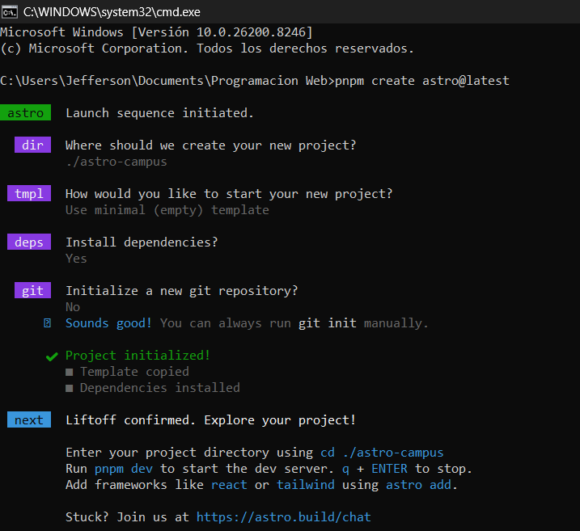
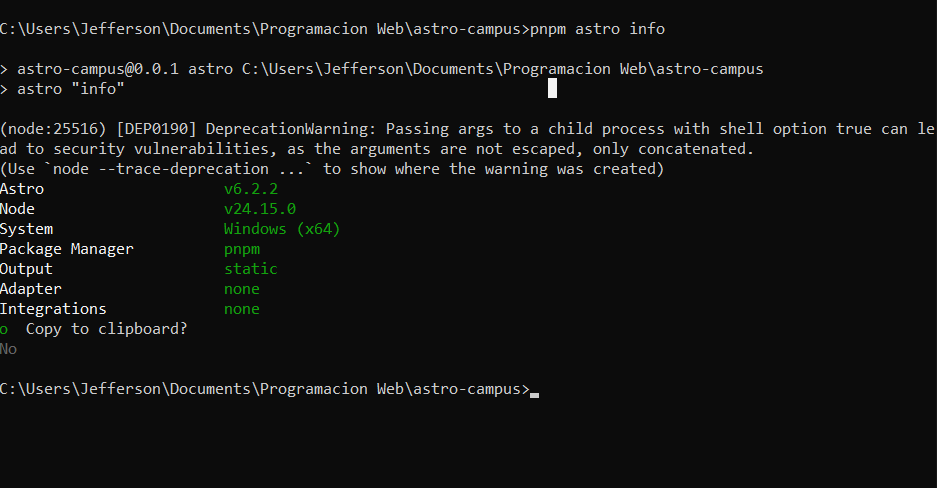
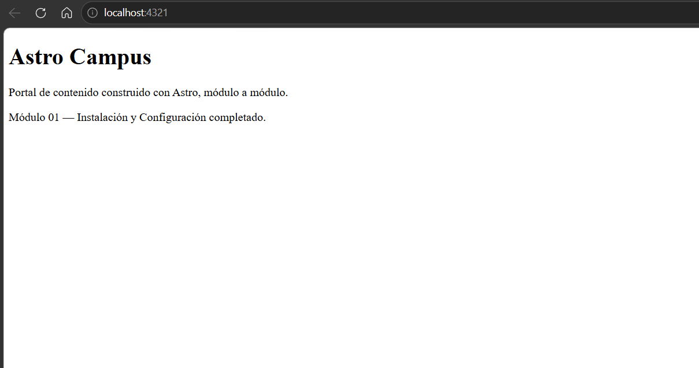
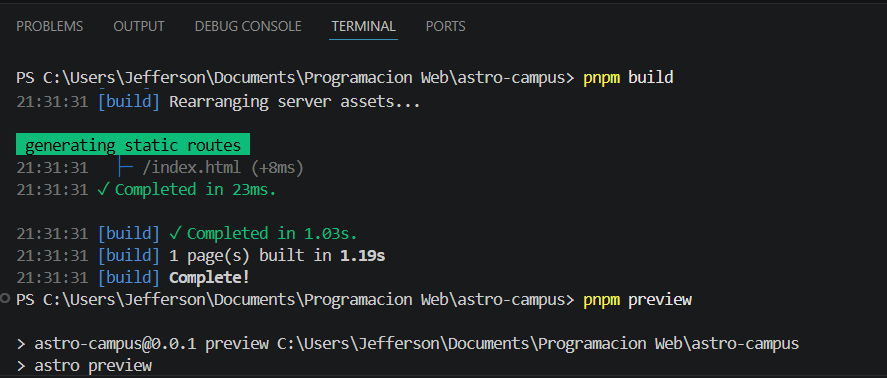
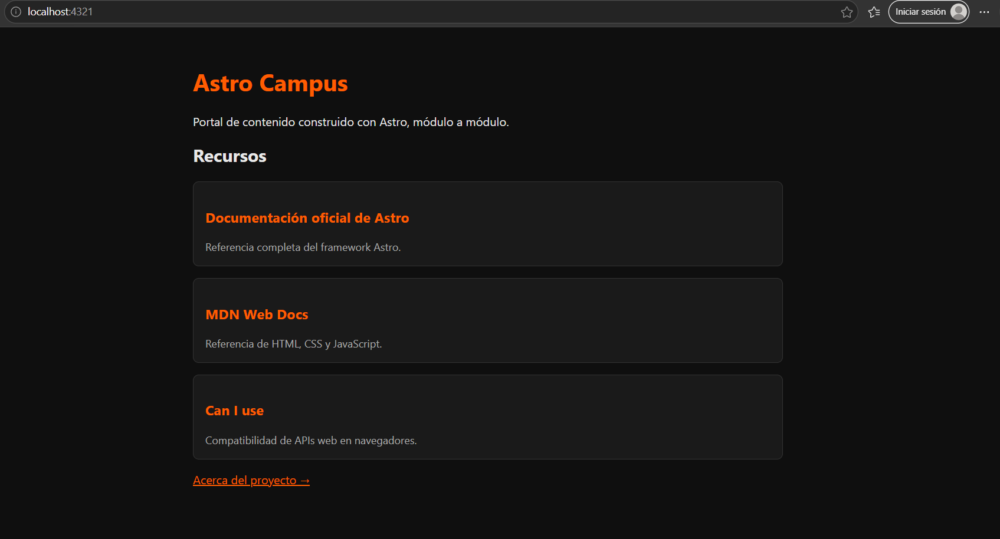
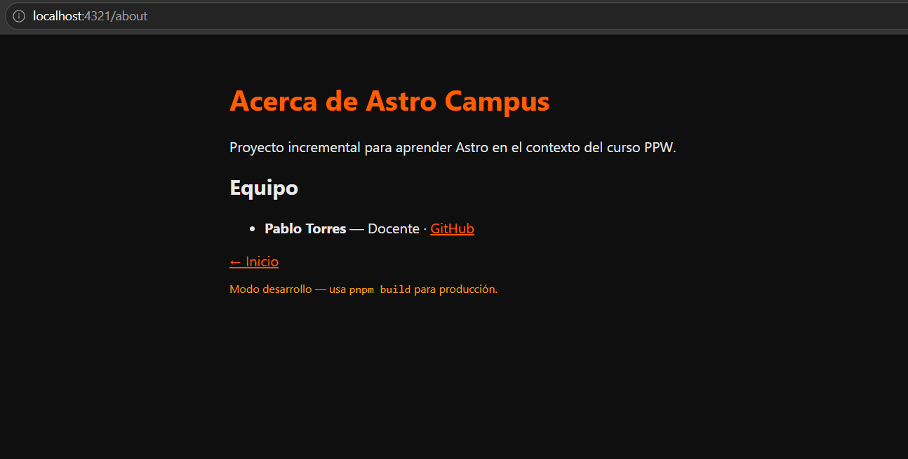
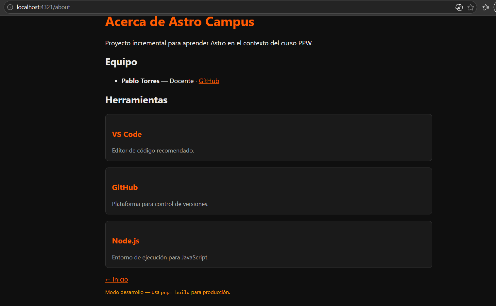

# Astro Campus
Este proyecto tiene como propósito crear un sitio web usando Astro que se irá desarrollando paso a paso en cada módulo de la materia

## 01-instalacion-configuracion

## i. Proceso de creación del proyecto

 

## ii. Salida de pnpm astro info

 

## iii. Sitio corriendo en localhost:4321

 

## iv. Salida del build de producción

 

---

## 02-fundamentos-astro

## i. Captura de http://localhost:4321 con los cards renderizados

 

## ii. Captura de http://localhost:4321/about

 

